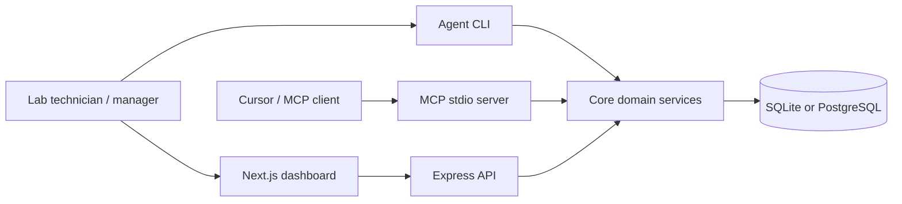
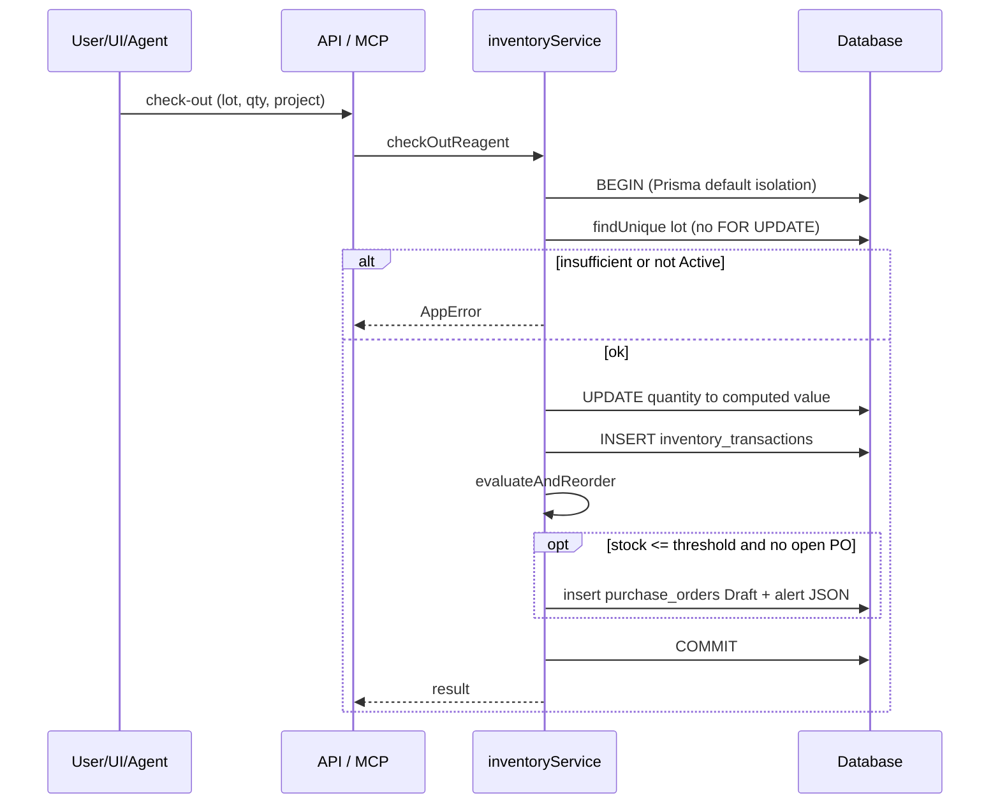
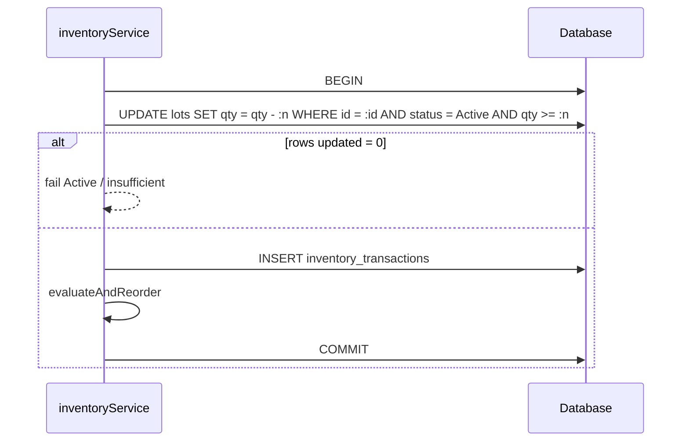
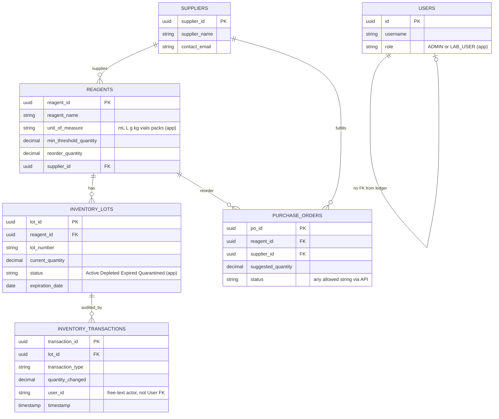

# ML-IMS Architecture

## System context



## Monorepo packages

| Path | Responsibility |
|------|----------------|
| `apps/web` | React UI: dashboard, scanner, admin create-forms, PO status buttons |
| `apps/api` | REST API, JWT auth, request logging, expiration cron |
| `apps/mcp` | MCP tool surface for AI agents (trusted local process) |
| `apps/agent` | Natural-language execution loop (CLI) |
| `packages/shared` | Zod schemas, `AppError`, allowed string unions (not DB enums) |
| `packages/db` | Prisma schema, seed, client export (`db:push` default; `db:migrate` exists) |
| `packages/core` | Check-out/in, reorder, reports, master-data CRUD, agent parser |

## Domain flow — check-out (current)

The API binds the actor from the JWT username. MCP/CLI pass a caller-supplied `userId` string.



**Integrity gap:** the read-then-write pattern is not an atomic `quantity >= requested` decrement and does not take a row lock. Concurrent check-outs can over-withdraw or lose updates, especially on PostgreSQL Read Committed. Target design is in [ROADMAP.md](./ROADMAP.md) Phase 1.

**Audit gap:** check-out/check-in append ledger rows. Admin `updateLot` can change quantity and status with no ledger row, reason, or reorder pass.

## Domain flow — check-out (target, Phase 1)



Alternatively: `SELECT … FOR UPDATE` (or serializable isolation) then update. Either approach must be covered by parallel check-out tests.

## Data model (logical ERD — current)

Statuses, units, roles, and transaction types are **application-validated strings**, not database enums. `inventory_transactions.user_id` is a string (typically username), not a foreign key to `users`.



Planned lot fields (manufacturer, catalog number, received date, COA/SDS, storage temperature, quarantine/disposal/adjustment reasons, approvals) are listed in [ROADMAP.md](./ROADMAP.md) Phase 2. Planned: User FK on transactions; CHECK/enum constraints; append-only enforcement on the ledger.

## Reorder formula

When Active stock ≤ `min_threshold_quantity` and no open PO (`Draft` | `Pending Approval` | `Submitted`):

```
suggested = max(reorder_quantity, avg_monthly_consumption * 1.5 - current_stock)
```

`avg_monthly_consumption` is total check-outs in the last 90 days ÷ 3. Quantity is summed without converting units; mixed-unit reagents on one project can distort consumption used for reorder.

## Purchase orders (current)

Draft POs are created by threshold evaluation. Dashboard/API can set status to any of the four values (including reverse or skip-to-Received). **Received does not ingest goods:** no received quantity, cost, invoice, lot, expiry, or stock insert. Target receive-PO flow: [ROADMAP.md](./ROADMAP.md) Phase 2.

## Reporting (current)

- Stock by location includes a single `totalQuantity` that **adds Active quantities across reagents**, including incompatible units.
- Consumption grouped by project likewise sums `quantity_changed` across units.
- Per-reagent rows do include `unitOfMeasure`; location/project totals must not be treated as a single physical quantity.

Target: totals only within a unit, or via a declared conversion model ([ROADMAP.md](./ROADMAP.md) Phase 4).

## Expiration job

`quarantineExpiredLots` compares `expiration_date` to midnight of the **API host local calendar**. There is no laboratory timezone setting. Quarantine is a status update only (no reason, no ledger row).

## Trust boundaries

| Surface | Current | Planned |
|---------|---------|---------|
| Web ↔ API | JWT in `Authorization: Bearer`; token stored in browser **localStorage** | HttpOnly SameSite cookies + CSRF; rate limit; revocation |
| REST actors | Check-out/in/agent use session **username** | Ledger stores `users.id` |
| MCP / agent CLI | Trusted local tools; optional free-text `userId` (default `DEFAULT_USER_ID`) | Service or OS identity; log every tool call |
| Database | App Zod validation; Prisma user can UPDATE/DELETE ledger rows | Enums/CHECKs; deny ledger mutation |
| Network | Intended for trusted lab / intranet | Same, plus session hardening before internet exposure |

Keep a strong `JWT_SECRET` and prefer private-network deployment. Details: [SECURITY.md](../SECURITY.md).
