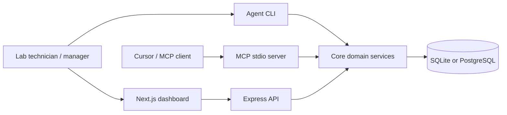
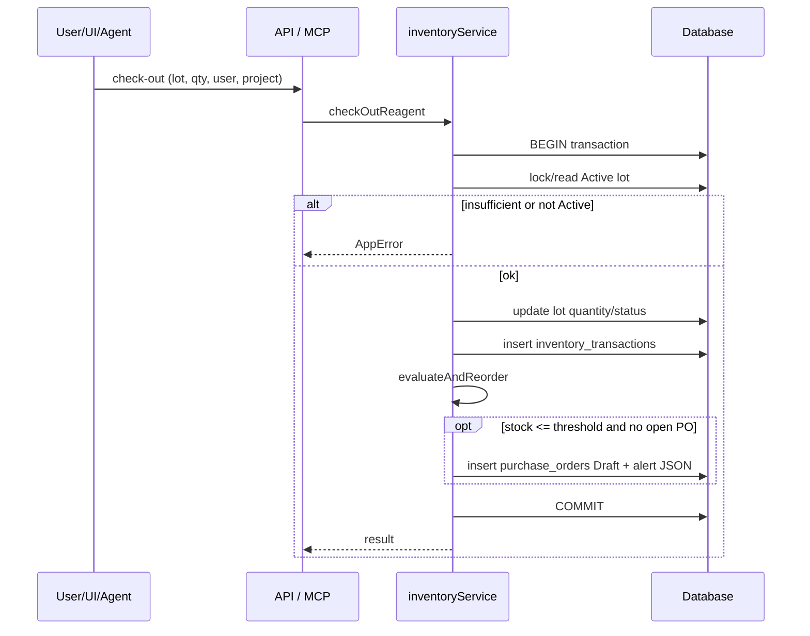
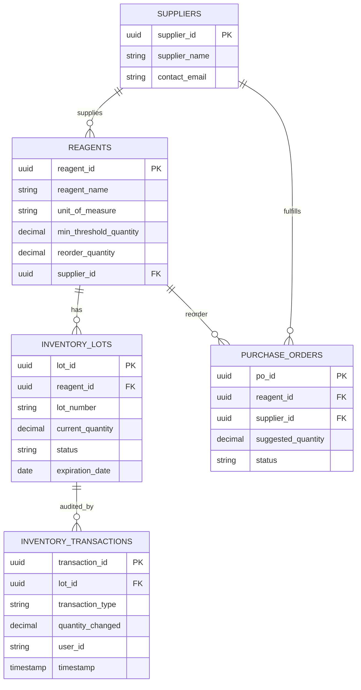

# ML-IMS Architecture

## System context



## Monorepo packages

| Path | Responsibility |
|------|----------------|
| `apps/web` | React UI: dashboard, scanner, admin forms, PO actions |
| `apps/api` | REST API, request logging, expiration cron |
| `apps/mcp` | MCP tool surface for AI agents |
| `apps/agent` | Natural-language execution loop (CLI) |
| `packages/shared` | Zod schemas, `AppError`, shared enums |
| `packages/db` | Prisma schema, migrations, seed, client export |
| `packages/core` | Check-out/in, reorder, reports, master-data CRUD, agent parser |

## Domain flow — check-out



## Data model (logical ERD)



## Reorder formula

When Active stock ≤ `min_threshold_quantity` and no open PO (`Draft` | `Pending Approval` | `Submitted`):

```
suggested = max(reorder_quantity, avg_monthly_consumption * 1.5 - current_stock)
```

`avg_monthly_consumption` is total check-outs in the last 90 days ÷ 3.

## Trust boundaries

- Current release is intended for trusted lab networks.
- Mutating APIs accept a free-text `userId` (no login yet).
- Do not expose the API to the public internet without adding authentication.
